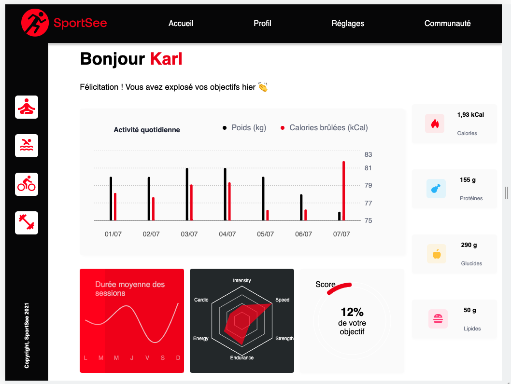

# $\color{red}{SportSee}$

  

## $\color{red}{Purpose}$

SportSee is an application that allows users to track their fitness progress by providing visual representations of their activity data. With the dashboard analytics, users can:

-   Track the number of sessions they have completed.
-   Monitor the calories burned during their sessions.
-   Visualize their activity data through interactive charts and graphs.
-   Gain insights into their performance and achievements.

  
  

## $\color{red}{Objectif}$

  

-   Build a functional user profile page with analytics using React.
-   Integrate charts to display user activity data.
-   Fetch and handle data from a Node.js backend or mock API.
-   Ensure proper data formatting and modeling.
-   Focus on the desktop version of the page and support specific screen sizes.
-   Optionally provide project documentation for collaboration and future development.

  

## $\color{red}{Features}$

  -   Develop a user profile page with analytics for SportSee.
-   Implement tracking of the number of sessions and calories burned for the user.
-   Use React to build the profile page.
-   Integrate charts and graphs to visualize user activity using Recharts.
-   Focus on desktop version CSS integration, with support for screens at least 1024 by 780 pixels.
-   Utilize a Node.js backend for making HTTP calls and retrieving sample data.
-   Create a separate service to handle API calls outside of React components.
-   Begin the project by mocking the API data and later integrate the actual API.
-   Develop a data modeling class to ensure proper formatting of API data.
-   Optionally document the project using a Readme, JSDoc, or PropTypes.

----------
## $\color{red}{Data Source}$

This project supports two modes for data retrieval: **mocked data** and **real data**. The mode can be configured by setting the `REACT_APP_DATA_MOCKED` variable in the `.env` file.

-   When `REACT_APP_DATA_MOCKED` is set to `true`, the project will use **mocked data**. This means that sample data will be used for development and testing purposes, providing a simulated data environment.
    
-   When `REACT_APP_DATA_MOCKED` is set to `false`, the project will retrieve **real data** from the server. For real data, a separate backend server is required. You can find the backend server at [https://github.com/samarkand-fr/P12-back-end-dashboard.git](https://github.com/samarkand-fr/P12-back-end-dashboard.git). Please follow the instructions provided in the backend repository to set up and run the server.
  

## $\color{red}{Prerequisites}$

*  **Node.js**: Ensure that you have Node.js installed on your machine. You can download it from the official Node.js website and follow the installation instructions.

  

## $\color{red}{Installation}$

1.  **Clone the repository**:

git clone https://github.com/samarkand-fr/P12-front-end-dashboard-.git

2.  **Navigate to the project folder:**:

cd P12-front-end-dashboard-

3.  **install project dependencies:**:

  npm install 

4.  **Launch the application**:

  npm start

  
The project will be accessible at [http://localhost:3000](http://localhost:3000/) in your browser.

If you are using a backend, you can access the application at  http://localhost:3001 .